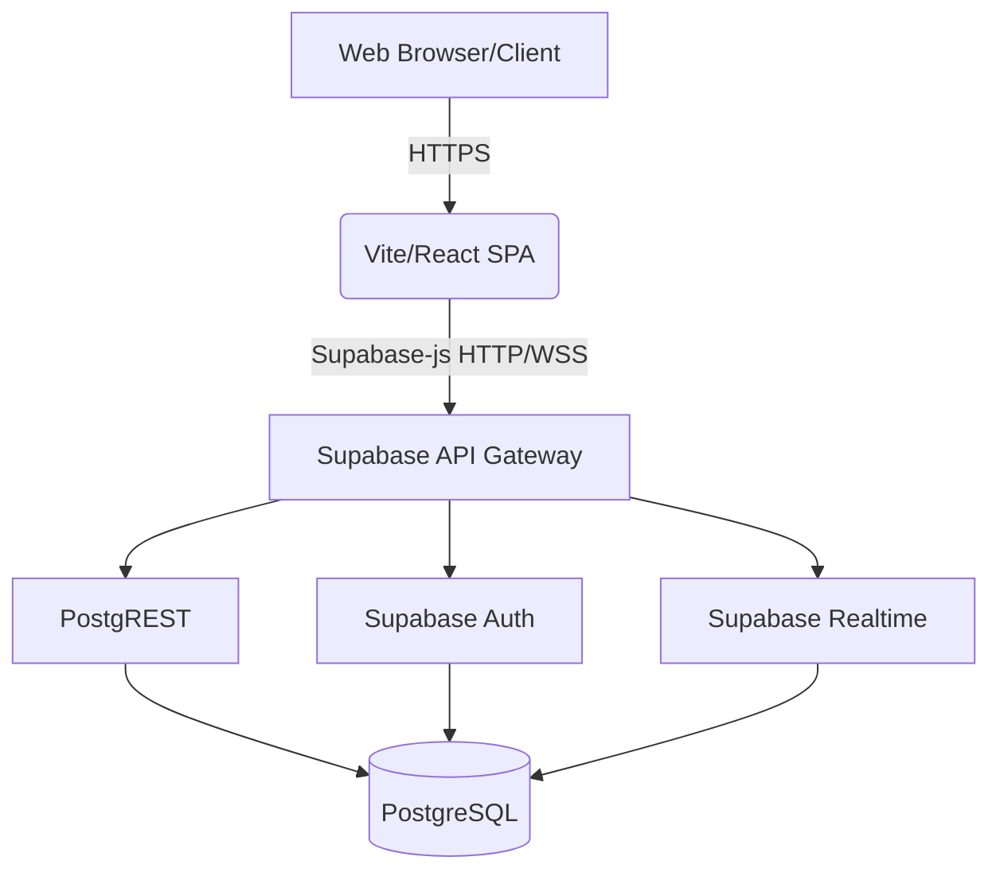

# SubPool Technical Architecture & System Design

## 1. System Overview
SubPool is a modern web application designed to facilitate the sharing and management of subscription pools (e.g., Netflix, ChatGPT Plus, Figma) among users, allowing them to split costs. 

## 2. Technology Stack
The application relies on a robust and modern stack optimized for performance, developer experience, and scalability.

### Frontend
* **Core Framework:** React 18 with TypeScript. Chosen for its strict type safety, vast ecosystem, and component-driven architecture.
* **Build Tool:** Vite. Selected for extremely fast Hot Module Replacement (HMR) and optimized build times compared to traditional bundlers like Webpack.
* **Styling & UI:** TailwindCSS, combined with Radix UI primitives and Class Variance Authority (CVA). Tailwind provides utility-first rapid styling, while Radix UI offers accessible, unstyled base components (Modals, Dropdowns, Tabs) that are customized using Tailwind.
* **Routing:** React Router v7. Chosen for reliable client-side routing.
* **State Management & Data Fetching:** Utilizes React Hooks and Supabase SDK for real-time reactivity and data fetching.
* **Animations:** Framer Motion (`motion`) and Tailwind animations. Selected to provide a premium, dynamic feel with micro-interactions.

### Backend & Database
* **BaaS (Backend as a Service):** Supabase. Supabase provides an out-of-the-box PostgreSQL database, Authentication, Realtime subscriptions, and Edge Functions. It accelerates development by removing the need to manage backend infrastructure.
* **Database:** PostgreSQL. Chosen for its reliability, ACID compliance, and advanced features (like Row Level Security and Full-Text Search), which are extensively used in SubPool.
* **Authentication:** Supabase Auth (supports email/password and OAuth).

### Tooling & DevOps
* **Testing:** Playwright for E2E and A11y testing; Vitest and Testing Library for unit/integration testing.
* **Linting/Formatting:** Biome/ESLint & Prettier (implied by standard setup).

## 3. High-Level Architecture Diagram

## 4. Key Design Decisions & Justifications
1. **Row Level Security (RLS) in PostgreSQL:** All data access control is handled at the database layer using RLS. This ensures that even if the frontend has vulnerabilities, the database remains secure. For example, messages can only be read by pool members or owners.
2. **Real-time Subscriptions:** Using Supabase's Realtime capabilities for the messaging system (`messages` table) provides instant communication between pool members without polling the server.
3. **Full-Text Search:** Implemented efficiently at the database level using PostgreSQL's `tsvector` and GIN indexes on the `pools` table, ensuring fast search queries without relying on a third-party service like Algolia for the MVP.
4. **Trigger-based Automation:** Market metrics (`pool_market_metrics`) and audit logs (`ledger_audit`) are maintained via PostgreSQL triggers to ensure absolute data consistency and reduce application-layer logic complexity.
