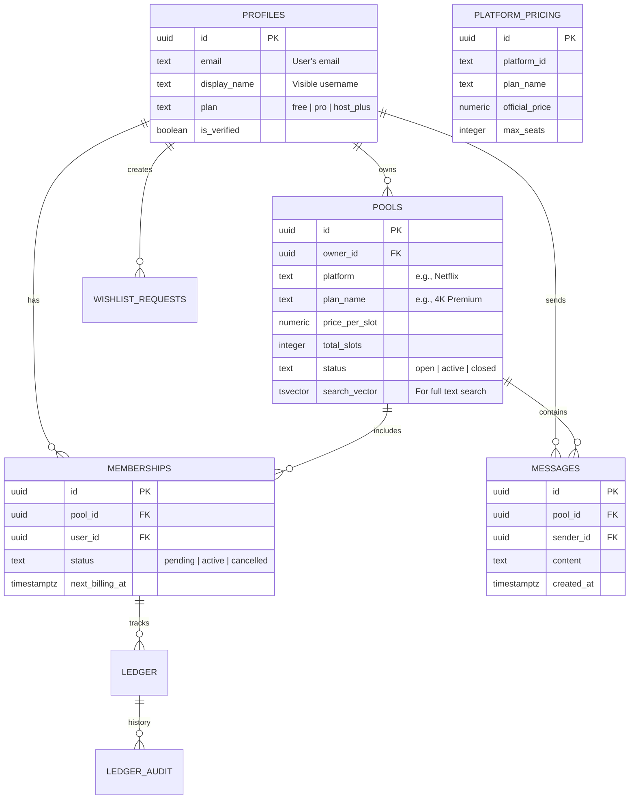

# SubPool Database Schema Documentation

## 1. Concept Overviews
SubPool uses PostgreSQL (via Supabase). The schema heavily utilizes Row Level Security (RLS) policies to enforce access controls on the database level, preventing unauthorized access directly from REST APIs. Triggers are used for robust audit tracking and asynchronous counter updates.

## 2. Entity Relationship Diagram (ERD)

## 3. Key Tables & Functions

### `pools`
The core entity representing a shared subscription.
* **RLS Policies:**
    * Read: Public
    * Insert/Update: Authenticated users.
* **Performance:** Uses GIN indexing on `search_vector` for fast keyword lookup combining platform, plan, and category.

### `messages`
Stores chat history for active pools.
* **RLS Policies:**
    * Read: Only owner of `pool_id` or users with an `active` membership in `pool_id`.
    * Insert: Only owner or `active` members (where `auth.uid() = sender_id`).
* **Realtime:** Realtime subscriptions are enabled via logical replication for instant chat delivery.

### `platform_pricing` & `pool_market_metrics` (Pricing Intelligence)
Stores baseline official pricing (`platform_pricing`) and aggregate statistics calculated dynamically from existing pools (`pool_market_metrics`).
* **Triggers:** A trigger on `pools` insert/update/delete calls `refresh_pool_market_metrics()` to recompute market averages (avg_slot_price) automatically.

### `ledger` & `ledger_audit` (Financial Tracking)
Tracks payment flows internally.
* **Audit Triggers:** Any UPDATE to the `ledger` table fires the `record_ledger_audit()` trigger which logs the exact changes (`old_amount`, `new_amount`, `old_status`, `new_status`) to `ledger_audit`.

### `rate_limits` Functionality
A pure PostgreSQL function `check_rate_limit(p_user_id, p_action, p_max_per_min)` tracks actions inside the `rate_limits` table to prevent abuse, enforced by a trigger on mutations for the `pools` table.
